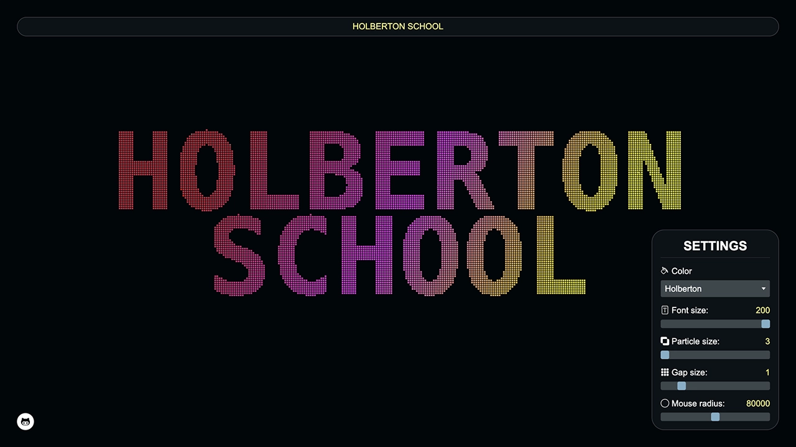
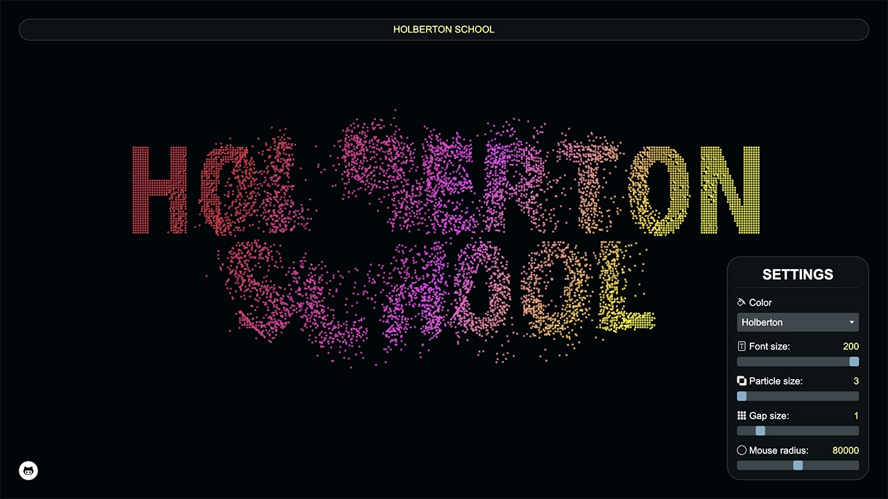

# Holberton Letter Particles

## Description

This project originates from a tutorial by [Frank Dvorak](https://www.youtube.com/@Frankslaboratory/featured), which introduced the foundational concepts behind text-based particle animation.

Building on this foundation, I expanded the project with interactive customization features and a user-friendly settings menu.

By leveraging HTML5 Canvas and JavaScript, this project demonstrates the potential of web animations in an engaging and customizable way.

## Objectives

- Enhance my skills in JavaScript and HTML5 Canvas through creative coding.
- Develop a visually captivating animation that reacts to user input.
- Create an interactive and educational experience for users.
- Practice and refine object-oriented programming (OOP) principles.
- Implement real-time customization features via a settings menu.
- Deliver a polished and engaging user interface.

## Tech Stack


## File Description


| **FILE**     | **DESCRIPTION**                                             |
| :----------: | ----------------------------------------------------------- |
| `assets`     | Contains the resources required for the repository.         |
| `index.html` | Main HTML structure for the project.                        |
| `style.css`  | Contains all styling rules for the application.             |
| `script.js`  | Main JavaScript file managing canvas rendering and effects. |
| `README.md`  | The README file you are currently reading 😉.               |

## Installation & Usage

### Installation

1. Clone this repository:
    - Open your preferred Terminal.
    - Navigate to the directory where you want to clone the repository.
    - Run the following command:

```
git clone https://github.com/fchavonet/full_stack-holberton_letter_particles.git
```

2. Open the cloned repository.

### Usage

1. Open the `index.html` file in your web browser.

2. Use the top input field to change the displayed text.

3. Customize the particles using the settings menu:

    - Choose a color or gradient for the particle effect.
    - Adjust font size, particle size, gap size, and mouse interaction radius.

4. Interact with the canvas using your mouse to see the particles react dynamically.

You can also test the project online by clicking [here](https://fchavonet.github.io/full_stack-holberton_letter_particles/).




## What's Next?

- Add more predefined color themes and gradients.
- Improve responsiveness to ensure the effect works seamlessly on mobile devices.
- Experiment with new visual effects to diversify animations.
- Optimize performance.

## Thanks

- Thank you to [Frank Dvorak](https://www.youtube.com/@Frankslaboratory/featured) for his tutorials on canvas and particle manipulations.

## Author(s)

**Fabien CHAVONET**
- GitHub: [@fchavonet](https://github.com/fchavonet)
